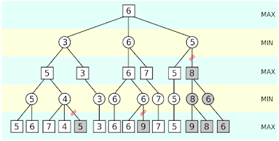

## MiniMax 對局搜尋演算法
MiniMax算法常用於棋類等由兩方較量的遊戲和程序。該算法是一個零總和算法，即一方要在可選的選項中選擇將其優勢最大化的選擇，另一方則選擇令對手優勢最小化的方法。而開始的時候總和為0。很多棋類遊戲可以採取此算法，例如圈圈叉叉。

## Alpha-Beta 剪枝法
Alpha-Beta 剪枝是 Minimax 對局搜尋法的一個修改版，主要是在 Minimax 當中加入了 α 與 β 兩個紀錄值，用來做為是否要修剪的參考標準。兩個參數以交錯的方式傳遞給下層的子樹。
* 在最大層取最大值的時候，若發現了一個大於等於β 的值，就不用再對其它分枝進行搜尋，這就是所謂的 β  剪枝。
* 在最小層取最小值的時候，發現了一個小於等於α 的值，也不用再對其它分枝進行搜尋，這就是所謂的α  剪枝。
### Alpha-Beta 剪枝結論
* α-β剪枝真正關注的是(α, β)區間內的估值。對於區間之外的估值，則會引發剪枝
* Alpha-beta剪枝不會影響Minimax搜尋法的結果
* 修剪法並不保證能將對局樹修剪得非常小，而且樹的大小會與拜訪的順序有關，但通常應用上我們可以做到接近最佳情況(O(bm/2))。

### 參考文獻
https://mropengate.blogspot.com/2015/04/ai-ch4-minimax-alpha-beta-pruning.html