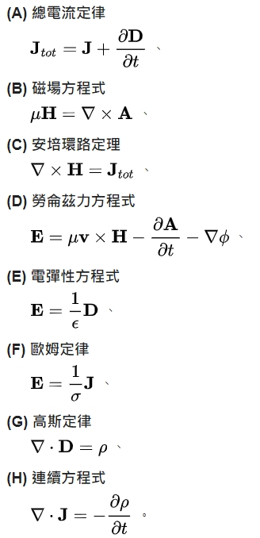

## 數學架構: 集合、邏輯、函數、關係、證明
### 代數
```
 代數學
 線性代數
 群論
 伽羅瓦理論
 數論
```
### 幾何
```
 歐氏幾何
 解析幾何
 非歐幾何
 微分幾何
```
### 分析
```
 分析學基礎
 微積分
 微分方程
 實數函數
 復變函數
```
## 電磁場的動力學理論
他首次系統性地陳列出馬克士威方程組。馬克士威又應用了先前在他的1861年論文《論物理力線》裏提出的位移電流的概念，來推導出電磁波方程式。由於這導引將電學、磁學和光學聯結成一個統一理論。這創舉現在已被物理學術界公認為物理學史的重大里程碑。
這篇論文明確地闡明，能量儲存於電磁場內。因此，它在歷史上首先建立了場論的基礎概念
### 馬克士威方程式




### 參考文獻
https://zh.wikipedia.org/wiki/%E9%9B%BB%E7%A3%81%E5%A0%B4%E7%9A%84%E5%8B%95%E5%8A%9B%E5%AD%B8%E7%90%86%E8%AB%96