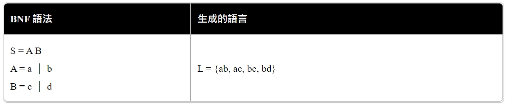

## 自然語言與人造語言
通常是指一種自然地隨文化演化的語言。漢語、英語、法語、西班牙語、葡萄牙文、日語、韓語、義大利文、德文為自然語言的例子。
不過，有時所有人類使用的語言（包括上述自然地隨文化演化的語言，以及人工語言）都會被視為「自然」語言，以相對於如程式語言等為電腦而設的「人造」語言。
## 自然語言處理
此領域探討如何處理及運用自然語言；自然語言處理包括多方面和步驟，基本有認知、理解、生成等部分。

自然語言認知和理解是讓電腦把輸入的語言變成有意思的符號和關係，然後根據目的再處理。自然語言生成系統則是把計算機數據轉化為自然語言。
## 自然語言處理的層次

* 語音、圖像和文本
* 中文分詞、詞性標註和命名實體識別
* 信息抽取
* 文本分類與文本聚類 
* 句法分析
* 語義分析與篇章分析
* 其他高級任務
## Chomsky Hierarchy (喬姆斯基語言階層）

* Type1 語言的語法有點限制，因為每個規則的左邊至少要有一個非終端項目 A，但其前後可以連接任意規則，這種語法所能描述的語言稱為「對上下文敏感的語言」 (Context-Sensitive)，因為 可以決定之後到底是否要接 ，所以前後文之間是有關係的，因此才叫做「對上下文敏感的語言」。這種語言在計算理論上可以對應到「線性有界的非決定性圖靈機」，也就是一台「記憶體有限的電腦」。
* Type2 語言的語法限制更大，因為規則左邊只能有一個非終端項目 (以 A 代表)，規則右邊則沒有限制這種語言被稱為「上下文無關的語言」(Context Free) ，在計算理論上可以對應到 「非決定性的堆疊機」(non-deterministic pushdown automaton)。
* Type3 的語法限制是最多的，其規則的左右兩邊都最多只能有一個非終端項目 (以 A, B 表示) ，而且右端的終端項目 (以 a 表示) 只能放在非終端項目 B 的前面。這種語言稱為「正規式」(Regular)，可以用程式設計中常用的「正規表達式」(Regular Expression) 表示，對應到計算理論中的有限狀態機(Finite State Automaton)。

## BNF 與生成語法

### 參考文獻
https://zh.wikipedia.org/wiki/%E8%87%AA%E7%84%B6%E8%AF%AD%E8%A8%80
https://zh.wikipedia.org/wiki/%E8%87%AA%E7%84%B6%E8%AF%AD%E8%A8%80%E5%A4%84%E7%90%86
https://codertw.com/%E7%A8%8B%E5%BC%8F%E8%AA%9E%E8%A8%80/750754/#outline__1_4
https://medium.com/%E4%BA%BA%E5%B7%A5%E6%99%BA%E6%85%A7/%E8%AA%9E%E6%B3%95%E7%90%86%E8%AB%96-23bc87126e6
https://programmermedia.org/root/%E9%99%B3%E9%8D%BE%E8%AA%A0/%E6%9B%B8%E7%B1%8D/aijs/07-%E8%AA%9E%E8%A8%80%E8%99%95%E7%90%86/B1-%E7%94%9F%E6%88%90%E8%AA%9E%E6%B3%95.md