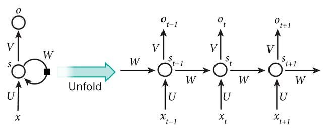
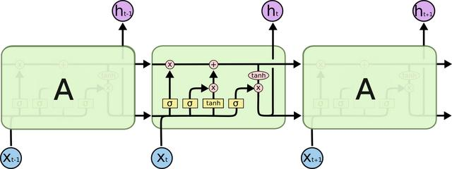

## colab
Colaboratory（也稱為Colab）是一個免費的Jupyter Notebook環境，它在雲端中運行，並將筆記本存儲在Google雲端端硬碟上。Colaboratory最初是Jupyter專案的一部分，但最終被Google接管。截止到2018年9月，Colaboratory只支援Python 2和Python 3核心，不支援其他Jupyter核心，比如Julia和R。
* 優點
  * 使用雲端空間，不用自己的電腦空間。
  * 可免費用 Colab 的 GPU 算力，執行深度學習速度有感。
  * 可以跳過 Mac 、 Win 的各種坑，設定省心。
  * 手機平板也可以執行，但建議只用來看成果，因為容易斷線且優化待加強。
* 缺點
  * 佔用 Google 雲端硬碟容量。
  * 部分功能及服務需付費。
  * 雲端服務一定要有網路。

## RNN
RNN是為了對序列數據進行建模而產生的。文本，是字母和詞彙的序列；語音，是音節的序列；視頻，是圖像的序列；氣象觀測數據，股票交易數據等等，也都是序列數據。

RNN背後的核心理念是利用序列的信息。傳統的神經網絡常常假設輸入（輸出）是獨立於彼此的，這對於某些應用來說是不可行的。
以下是RNN的典型結構：

## LSTM
對RNN的隱藏層做了改進以解決長期依賴問題，是近來流行的RNN類型。LSTM可以通過gate決定網絡需要記住和遺忘多長時間之前的記憶，以此聯合之前的狀態、記憶和輸入。

### 參考文獻
https://zh.wikipedia.org/wiki/Jupyter#Colaboratory
https://hackmd.io/@wiimax/S1VGctnSS#%E5%84%AA%E7%BC%BA%E9%BB%9E%E6%AF%94%E8%BC%83
https://ai-stockboy.medium.com/%E6%88%91%E6%83%B3%E5%AD%B8-python-a-i-%E8%A9%B2%E5%BE%9E%E4%BD%95%E5%85%A5%E6%89%8B-e31ef8d8b2e2
https://kknews.cc/news/6jnmq3.html