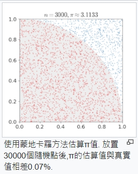
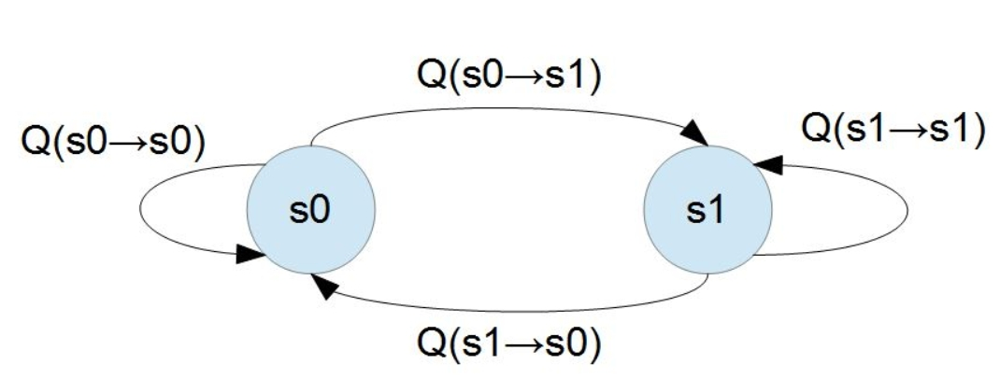
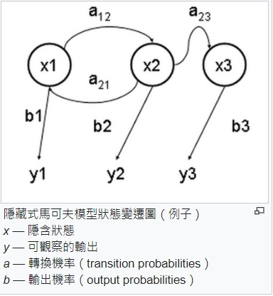
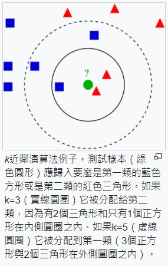
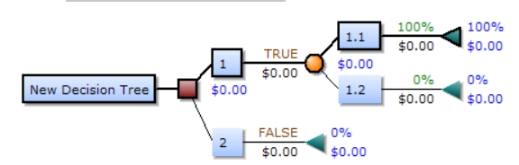

## 機器學習
機器學習理論主要是設計和分析一些讓電腦可以自動「學習」的演算法。機器學習演算法是一類從資料中自動分析獲得規律，並利用規律對未知資料進行預測的演算法。
## 蒙地卡羅法


蒙地卡羅方法可以粗略地分成兩類：
* 所求解的問題本身具有內在的隨機性，藉助電腦的運算能力可以直接類比這種隨機的過程。
* 所求解問題可以轉化為某種隨機分布的特徵數，比如隨機事件出現的機率，或者隨機變數的期望值。

工作過程:
* 用蒙地卡羅方法類比某一過程時，需要產生各種機率分布的隨機變數。
* 用統計方法把模型的數字特徵估計出來，從而得到實際問題的數值解。

## 馬可夫鏈

為狀態空間中經過從一個狀態到另一個狀態的轉換的隨機過程。該過程要求具備「無記憶」的性質：下一狀態的機率分布只能由當前狀態決定，在時間序列中它前面的事件均與之無關。這種特定類型的「無記憶性」稱作馬可夫性質。馬爾科夫鏈作為實際過程的統計模型具有許多應用。

在馬可夫鏈的每一步，系統根據機率分布，可以從一個狀態變到另一個狀態，也可以保持當前狀態。狀態的改變叫做轉移，與不同的狀態改變相關的機率叫做轉移機率。隨機漫步就是馬可夫鏈的例子。隨機漫步中每一步的狀態是在圖形中的點，每一步可以移動到任何一個相鄰的點，在這裡移動到每一個點的機率都是相同的（無論之前漫步路徑是如何的）。
* 討論不是互相獨立的一些事件。
* 下一狀態的機率分布只能由當前狀態決定，在時間序列中它前面的事件均與之無關。
* 種具有狀態的隨機過程
* ex: 轉移矩陣的應用問題


## 吉布斯採樣
是統計學中用於馬爾科夫蒙特卡洛（MCMC）的一種算法，用於在難以直接採樣時從某一多變量概率分布中近似抽取樣本序列。該序列可用於近似聯合分布、部分變量的邊緣分布或計算積分（如某一變量的期望值）。某些變量可能為已知變量，故對這些變量並不需要採樣。

## 隱藏式馬可夫模型
它用來描述一個含有隱含未知參數的馬可夫過程。其難點是從可觀察的參數中確定該過程的隱含參數。然後利用這些參數來作進一步的分析，例如圖型識別。

在正常的馬可夫模型中，狀態對於觀察者來說是直接可見的。這樣狀態的轉換機率便是全部的參數。而在隱藏式馬可夫模型中，狀態並不是直接可見的，但受狀態影響的某些變數則是可見的。每一個狀態在可能輸出的符號上都有一機率分布。因此輸出符號的序列能夠透露出狀態序列的一些資訊。


## 維特比演算法
它用於尋找最有可能產生觀測事件序列的維特比路徑——隱含狀態序列，特別是在馬可夫資訊源上下文和隱藏式馬可夫模型中。

術語「維特比路徑」和「維特比演算法」也被用於尋找觀察結果最有可能解釋相關的動態規划算法。
用於在數字通信鏈路中解摺積以消除噪音。此演算法被廣泛應用於CDMA和GSM數字蜂巢式網路、撥號數據機、衛星、深空通信和802.11無線網路中解摺積碼。現今也被常常用於語音辨識、關鍵字辨識、計算語言學和生物資訊學中。例如在語音（語音辨識）中，聲音訊號做為觀察到的事件序列，而文字字串，被看作是隱含的產生聲音訊號的原因，因此可對聲音訊號應用維特比演算法尋找最有可能的文字字串。


## EM演算法
* 在統計中被用於尋找，依賴於不可觀察的隱性變量的概率模型中，參數的最大似然估計。
### 執行 em.py
```
PS X:\人工智慧\ai109b> & C:/Users/abcd1/AppData/Local/Programs/Python/Python36/python.exe x:/人工智慧/ai/06-learn/05-em/em.py
pA=[0.6, 0.4] pB=[0.5, 0.5] delta=9.9999
pA=[0.71301224 0.28698776] pB=[0.58133931 0.41866069] delta=0.11301223540051619
pA=[0.74529204 0.25470796] pB=[0.56925575 0.43074425] delta=0.0322798006814784
pA=[0.76809883 0.23190117] pB=[0.54953591 0.45046409] delta=0.022806798285326613
pA=[0.78316458 0.21683542] pB=[0.53461745 0.46538255] delta=0.015065749932652417
pA=[0.79105525 0.20894475] pB=[0.52628117 0.47371883] delta=0.008336287117588381
pA=[0.79453254 0.20546746] pB=[0.52239044 0.47760956] delta=0.003890729512057156
pA=[0.79592867 0.20407133] pB=[0.52072988 0.47927012] delta=0.001660559431849007
```
## K-近鄰演算法
在圖型識別領域中，最近鄰居法（KNN演算法，又譯K-近鄰演算法）是一種用於分類和迴歸的無母數統計方法。在這兩種情況下，輸入包含特徵空間（Feature Space）中的k個最接近的訓練樣本。



## 決策樹
機器學習中，決策樹是一個預測模型；他代表的是對象屬性與對象值之間的一種映射關係。樹中每個節點表示某個對象，而每個分叉路徑則代表某個可能的屬性值，而每個葉節點則對應從根節點到該葉節點所經歷的路徑所表示的對象的值。決策樹僅有單一輸出，若欲有複數輸出，可以建立獨立的決策樹以處理不同輸出。 數據挖掘中決策樹是一種經常要用到的技術，可以用於分析數據，同樣也可以用來作預測。

一個決策樹包含三種類型的節點：

* 決策節點：通常用矩形框來表示
* 機會節點：通常用圓圈來表示
* 終結點：通常用三角形來表示



### 參考文獻
https://zh.wikipedia.org/wiki/%E8%92%99%E5%9C%B0%E5%8D%A1%E7%BE%85%E6%96%B9%E6%B3%95
https://zh.wikipedia.org/wiki/%E6%9C%BA%E5%99%A8%E5%AD%A6%E4%B9%A0
https://zh.wikipedia.org/wiki/%E9%A9%AC%E5%B0%94%E5%8F%AF%E5%A4%AB%E9%93%BE
https://zh.wikipedia.org/wiki/%E5%90%89%E5%B8%83%E6%96%AF%E9%87%87%E6%A0%B7
https://zh.wikipedia.org/wiki/%E9%9A%90%E9%A9%AC%E5%B0%94%E5%8F%AF%E5%A4%AB%E6%A8%A1%E5%9E%8B
https://zh.wikipedia.org/wiki/%E7%BB%B4%E7%89%B9%E6%AF%94%E7%AE%97%E6%B3%95
https://zh.wikipedia.org/wiki/%E6%9C%80%E5%A4%A7%E6%9C%9F%E6%9C%9B%E7%AE%97%E6%B3%95
https://zh.wikipedia.org/wiki/K-%E8%BF%91%E9%82%BB%E7%AE%97%E6%B3%95
https://zh.wikipedia.org/wiki/%E5%86%B3%E7%AD%96%E6%A0%91