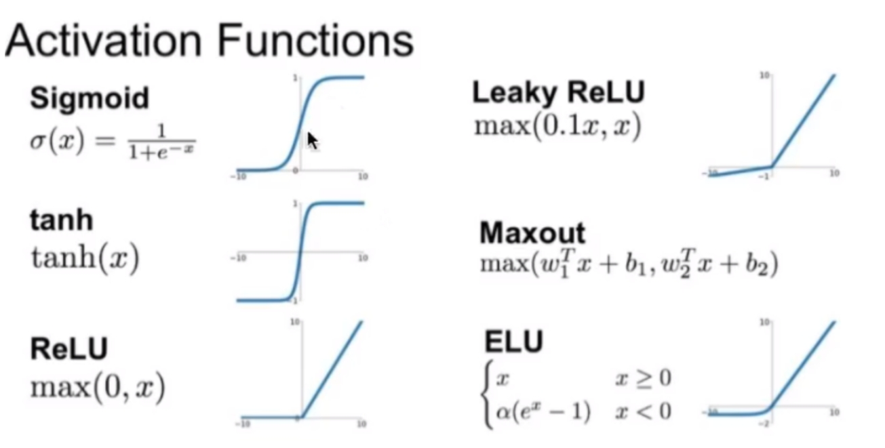
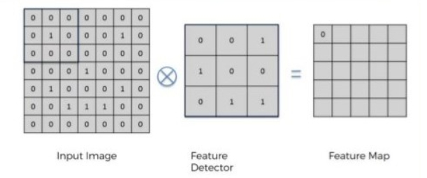
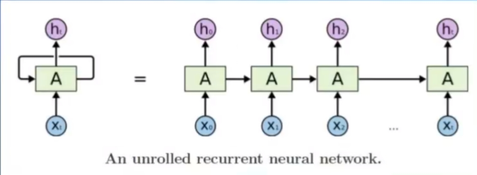
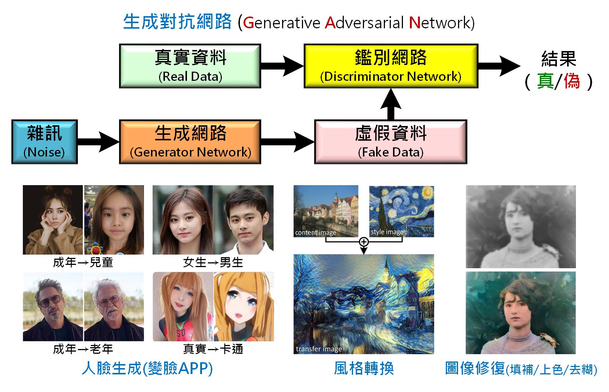

## 人工智慧的方法
* 比對法
    * 紀錄問題與答案配對後，直接從表格內查出。
    * 例如:Elisa
* 推理法
    * 撰寫規則後，電腦根據規則推論。
    * 例如:專家系統
* 搜尋法
    * 對所有可能的結果進行系統式的列舉，然後看看有沒有答案。
    * 例如:深度優先、廣度優先、電腦下棋
* 統計法
    * 找出機率最大的解答。
    * 例如:利用電腦亂數驗證中央極限定理
* 優化法
    * 對每個可能的解答，都給一個分數及權重，找出總分最好的解答。
    * 例如:爬山演算法、遺傳演算法
## 常見神經元的開關函數

## 深度學習的神經網路
除了多層感知器以外,還新增了
* 卷積神經網路CNN
* 循環神經網路RNN,LSTM
* 生成對抗網路GAN
* 強化學習機制(AlphaGo)
## 捲積神經網路CNN
是一種前饋神經網路，它的人工神經元可以回應一部分覆蓋範圍內的周圍單元，對於大型圖像處理有出色表現。
卷積神經網路由一個或多個卷積層和頂端的全連通層（對應經典的神經網路）組成，同時也包括關聯權重和池化層（pooling layer）。這一結構使得卷積神經網路能夠利用輸入資料的二維結構。與其他深度學習結構相比，卷積神經網路在圖像和語音辨識方面能夠給出更好的結果。這一模型也可以使用反向傳播演算法進行訓練。

## 循環神經網路RNN
單純的RNN因為無法處理隨著遞歸，權重指數級爆炸或梯度消失問題，難以捕捉長期時間關聯；而結合不同的LSTM可以很好解決這個問題。
時間循環神經網路可以描述動態時間行為，因為和前饋神經網路（feedforward neural network）接受較特定結構的輸入不同，RNN將狀態在自身網路中循環傳遞，因此可以接受更廣泛的時間序列結構輸入。手寫識別是最早成功利用RNN的研究結果。

## 生成對抗網路GAN
是非監督式學習的一種方法，通過讓兩個神經網路相互博弈的方式進行學習。生成對抗網絡由一個生成網絡與一個判別網絡組成。生成網絡從潛在空間（latent space）中隨機取樣作為輸入，其輸出結果需要盡量模仿訓練集中的真實樣本。判別網絡的輸入則為真實樣本或生成網絡的輸出，其目的是將生成網絡的輸出從真實樣本中盡可能分辨出來。而生成網絡則要盡可能地欺騙判別網絡。兩個網絡相互對抗、不斷調整參數，最終目的是使判別網絡無法判斷生成網絡的輸出結果是否真實。

## 強化學習機制
常常透過探索或自我對打找到好的策略來進行決策。
像AlphaGo就是機率模型+強化學習+神經網路結合的結果。

### 參考文獻
https://zh.wikipedia.org/wiki/%E5%BE%AA%E7%8E%AF%E7%A5%9E%E7%BB%8F%E7%BD%91%E7%BB%9C
https://zh.wikipedia.org/wiki/%E5%8D%B7%E7%A7%AF%E7%A5%9E%E7%BB%8F%E7%BD%91%E7%BB%9C
https://zh.wikipedia.org/wiki/%E7%94%9F%E6%88%90%E5%AF%B9%E6%8A%97%E7%BD%91%E7%BB%9C
https://aihub.org.tw/platform/specialist/article/d131b580-cd8a-11ea-b749-0242ac120002?page=