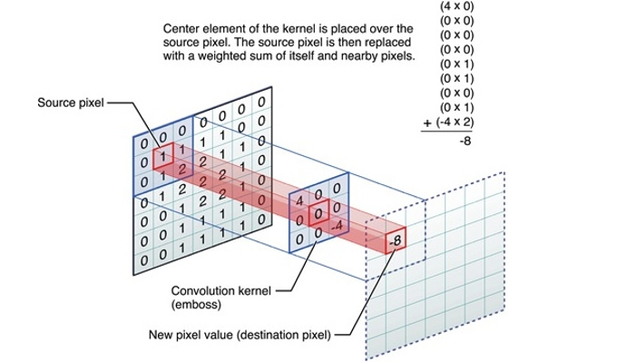

## 期末專案-圖片辨識
本程式與他校友人共同研究寫出
## 前言
* 目的: 透過深度學習的方式判別圖片的種類。
* 本專案利用CNN框架訓練出模型。
## CNN
* Convolution主要用以擷取資料特徵
* Pooling為縮圖的動作，可以減少運算資料量


## Convolution
* Convolution利用kernel(filter)來進行運算




## Pooling (Max Pooling)
* Max Pooling在每次縮圖時，取數值最大的像素留下來


## Deep Learning作業
### 資料：image_set
* 有六個資料夾，類型分別如下圖。
* 每個資料夾約有2000張影像


## 讀檔
```py
#training and testing初始化
x_train = np.zeros([1,150,150,3])
y_train = np.zeros([1,6])
x_test = np.zeros([1,150,150,3])
y_test = np.zeros([1,6])
```
```py
for i in range(1,1800):
    image = cv2.imread('.\\image_set\\buildings2191\\'+str(i)+'.jpg')
    image = image.reshape(1,150,150,3)
    x_train = np.append(x_train, image, axis=0)
    y_train = np.append(y_train, np_utils.to_categorical([0],6), axis=0)
    
for i in range(1800,2191):
    image = cv2.imread('.\\image_set\\buildings2191\\'+str(i)+'.jpg')
    image = image.reshape(1,150,150,3)
    x_test = np.append(x_test, image, axis=0)
    y_test = np.append(y_test, np_utils.to_categorical([0],6), axis=0)
```
        讀取buildings類型資料，上下兩個迴圈分別加入training與testing資料
```py
for i in range(1,1800):
    image = cv2.imread('.\\image_set\\forest2271\\'+str(i)+'.jpg')
    image = image.reshape(1,150,150,3)
    x_train = np.append(x_train, image, axis=0)
    y_train = np.append(y_train, np_utils.to_categorical([1],6), axis=0)

```
        讀取forest類型資料，其他類型，以此類推
```py
model = Sequential()

#注意input_shape要依資料作變化
model.add(…, input_shape=(?,?,?), …)
```
## 修改前
```py
import numpy as np
import cv2
from tensorflow.keras.models import Sequential
from tensorflow.keras.layers import Dense, Dropout, Activation, Flatten
from tensorflow.keras.layers import Conv2D, MaxPooling2D
from tensorflow.keras.datasets import mnist
from tensorflow.python.keras.utils import np_utils
from matplotlib import pyplot as plt

x_train = np.zeros([1,150,150,3])
y_train = np.zeros([1,6])
x_test = np.zeros([1,150,150,3])
y_test = np.zeros([1,6])
model = Sequential()

for i in range(1,100):
    image = cv2.imread('C:\\Users\\wwww0\Desktop\\image_set\\buildings2191\\'+str(i)+'.jpg')
    image = image.reshape(1,150,150,3)
    x_train = np.append(x_train, image, axis=0)
    y_train = np.append(y_train, np_utils.to_categorical([0],6), axis=0)
    
for i in range(100,150):
    image = cv2.imread('C:\\Users\\wwww0\Desktop\\image_set\\buildings2191\\'+str(i)+'.jpg')
    image = image.reshape(1,150,150,3)
    x_test = np.append(x_test, image, axis=0)
    y_test = np.append(y_test, np_utils.to_categorical([0],6), axis=0)
for i in range(1,100):
    image = cv2.imread('C:\\Users\\wwww0\Desktop\\image_set\\forest2271\\'+str(i)+'.jpg')
    image = image.reshape(1,150,150,3)
    x_train = np.append(x_train, image, axis=0)
    y_train = np.append(y_train, np_utils.to_categorical([1],6), axis=0)
for i in range(100,150):
    image = cv2.imread('C:\\Users\\wwww0\Desktop\\image_set\\forest2271\\'+str(i)+'.jpg')
    image = image.reshape(1,150,150,3)
    x_test = np.append(x_test, image, axis=0)
    y_test = np.append(y_test, np_utils.to_categorical([1],6), axis=0)
for i in range(1,100):
    image = cv2.imread('C:\\Users\\wwww0\Desktop\\image_set\\glacier2404\\'+str(i)+'.jpg')
    image = image.reshape(1,150,150,3)
    x_train = np.append(x_train, image, axis=0)
    y_train = np.append(y_train, np_utils.to_categorical([2],6), axis=0)
for i in range(100,150):
    image = cv2.imread('C:\\Users\\wwww0\Desktop\\image_set\\glacier2404\\'+str(i)+'.jpg')
    image = image.reshape(1,150,150,3)
    x_test = np.append(x_test, image, axis=0)
    y_test = np.append(y_test, np_utils.to_categorical([2],6), axis=0)
for i in range(1,100):
    image = cv2.imread('C:\\Users\\wwww0\Desktop\\image_set\\mountain2512\\'+str(i)+'.jpg')
    image = image.reshape(1,150,150,3)
    x_train = np.append(x_train, image, axis=0)
    y_train = np.append(y_train, np_utils.to_categorical([3],6), axis=0)
for i in range(100,150):
    image = cv2.imread('C:\\Users\\wwww0\Desktop\\image_set\\mountain2512\\'+str(i)+'.jpg')
    image = image.reshape(1,150,150,3)
    x_test = np.append(x_test, image, axis=0)
    y_test = np.append(y_test, np_utils.to_categorical([3],6), axis=0)
for i in range(1,100):
    image = cv2.imread('C:\\Users\\wwww0\Desktop\\image_set\\sea2274\\'+str(i)+'.jpg')
    image = image.reshape(1,150,150,3)
    x_train = np.append(x_train, image, axis=0)
    y_train = np.append(y_train, np_utils.to_categorical([4],6), axis=0)
for i in range(100,150):
    image = cv2.imread('C:\\Users\\wwww0\Desktop\\image_set\\sea2274\\'+str(i)+'.jpg')
    image = image.reshape(1,150,150,3)
    x_test = np.append(x_test, image, axis=0)
    y_test = np.append(y_test, np_utils.to_categorical([4],6), axis=0)
for i in range(1,100):
    image = cv2.imread('C:\\Users\\wwww0\Desktop\\image_set\\street2382\\'+str(i)+'.jpg')
    image = image.reshape(1,150,150,3)
    x_train = np.append(x_train, image, axis=0)
    y_train = np.append(y_train, np_utils.to_categorical([5],6), axis=0)
for i in range(100,150):
    image = cv2.imread('C:\\Users\\wwww0\Desktop\\image_set\\street2382\\'+str(i)+'.jpg')
    image = image.reshape(1,150,150,3)
    x_test = np.append(x_test, image, axis=0)
    y_test = np.append(y_test, np_utils.to_categorical([5],6), axis=0)
model = Sequential()

model.add(Conv2D(filters=3, kernel_size=(3,3), activation='relu', input_shape=(150,150,3), data_format="channels_last"))
model.add(Conv2D(filters=10, kernel_size=(3,3), activation='relu'))

model.add(MaxPooling2D(pool_size=(2,2)))
model.add(Flatten())
model.add(Dense(units=20, activation = 'relu'))
model.add(Dense(units=20, activation = 'relu'))
model.add(Dense(units=6, activation='softmax'))
model.compile(loss='categorical_crossentropy', optimizer='adagrad', metrics=['accuracy'])
train_history = model.fit(x=x_train, y=y_train, epochs=5, batch_size=200)
result = model.evaluate(x_test, y_test)
print("\nAccuracy of testing data = ", result)
```
## 修改後-為了避免測試的時候學習時間過長，只讀取前150張圖片
```py
import numpy as np
import cv2
from tensorflow.keras.models import Sequential
from tensorflow.keras.layers import Dense, Dropout, Activation, Flatten
from tensorflow.keras.layers import Conv2D, MaxPooling2D
from tensorflow.keras.datasets import mnist
from tensorflow.python.keras.utils import np_utils
from matplotlib import pyplot as plt
#def load_data():
#    (x_train, y_train), (x_test, y_test) = mnist.load_data()
    
#    x_train = x_train.reshape(x_train.shape[0], 28, 28, 1)
#    x_test = x_test.reshape(x_test.shape[0], 28, 28, 1)
#    x_train = x_train.astype('float32')
#    x_test = x_test.astype('float32')
    
#    y_train = np_utils.to_categorical(y_train, 10)
#    y_test = np_utils.to_categorical(y_test, 10)
    
#   return (x_train, y_train), (x_test, y_test)

#(x_train, y_train), (x_test, y_test) = load_data()
x_train = np.zeros([1,28, 28, 1])
y_train = np.zeros([1,6])
x_test = np.zeros([1,28, 28, 1])
y_test = np.zeros([1,6])
model = Sequential()

model.add(Conv2D(filters=3, kernel_size=(3,3), activation='relu', input_shape=(28,28,1), data_format="channels_last"))
model.add(Conv2D(filters=10, kernel_size=(3,3), activation='relu'))

model.add(MaxPooling2D(pool_size=(2,2)))
model.add(Flatten())
model.add(Dense(units=20, activation = 'relu'))
model.add(Dense(units=20, activation = 'relu'))
model.add(Dense(units=10, activation='softmax'))
model.compile(loss='categorical_crossentropy', optimizer='adagrad', metrics=['accuracy'])
train_history = model.fit(x=x_train, y=y_train, epochs=5, batch_size=200)
result = model.evaluate(x_test, y_test)
print("\nAccuracy of testing data = ", result)
#deep learning

for i in range(1,1800):
    image = cv2.imread('.\\image_set\\buildings2191\\'+str(i)+'.jpg')
    image = image.reshape(1,28, 28, 1)
    x_train = np.append(x_train, image, axis=0)
    y_train = np.append(y_train, np_utils.to_categorical([0],6), axis=0)
    
for i in range(1800,2191):
    image = cv2.imread('.\\image_set\\buildings2191\\'+str(i)+'.jpg')
    image = image.reshape(1,28, 28, 1)
    x_test = np.append(x_test, image, axis=0)
    y_test = np.append(y_test, np_utils.to_categorical([0],6), axis=0)
for i in range(1,1800):
    image = cv2.imread('.\\image_set\\forest2271\\'+str(i)+'.jpg')
    image = image.reshape(1,28, 28, 1)
    x_train = np.append(x_train, image, axis=0)
    y_train = np.append(y_train, np_utils.to_categorical([1],6), axis=0)
for i in range(1800,2271):
    image = cv2.imread('.\\image_set\\forest2271\\'+str(i)+'.jpg')
    image = image.reshape(1,28, 28, 1)
    x_test = np.append(x_test, image, axis=0)
    y_test = np.append(y_test, np_utils.to_categorical([0],6), axis=0)
for i in range(1,1800):
    image = cv2.imread('.\\image_set\\glacier2404\\'+str(i)+'.jpg')
    image = image.reshape(1,28, 28, 1)
    x_train = np.append(x_train, image, axis=0)
    y_train = np.append(y_train, np_utils.to_categorical([1],6), axis=0)
for i in range(1800,2404):
    image = cv2.imread('.\\image_set\\glacier2404\\'+str(i)+'.jpg')
    image = image.reshape(1,28, 28, 1)
    x_test = np.append(x_test, image, axis=0)
    y_test = np.append(y_test, np_utils.to_categorical([0],6), axis=0)
for i in range(1,1800):
    image = cv2.imread('.\\image_set\\mountain2512\\'+str(i)+'.jpg')
    image = image.reshape(1,28, 28, 1)
    x_train = np.append(x_train, image, axis=0)
    y_train = np.append(y_train, np_utils.to_categorical([1],6), axis=0)
for i in range(1800,2512):
    image = cv2.imread('.\\image_set\\mountain2512\\'+str(i)+'.jpg')
    image = image.reshape(1,28, 28, 1)
    x_test = np.append(x_test, image, axis=0)
    y_test = np.append(y_test, np_utils.to_categorical([0],6), axis=0)
for i in range(1,1800):
    image = cv2.imread('.\\image_set\\sea2274\\'+str(i)+'.jpg')
    image = image.reshape(1,28, 28, 1)
    x_train = np.append(x_train, image, axis=0)
    y_train = np.append(y_train, np_utils.to_categorical([1],6), axis=0)
for i in range(1800,2274):
    image = cv2.imread('.\\image_set\\sea2274\\'+str(i)+'.jpg')
    image = image.reshape(1,28, 28, 1)
    x_test = np.append(x_test, image, axis=0)
    y_test = np.append(y_test, np_utils.to_categorical([0],6), axis=0)
for i in range(1,1800):
    image = cv2.imread('.\\image_set\\street2382\\'+str(i)+'.jpg')
    image = image.reshape(1,28, 28, 1)
    x_train = np.append(x_train, image, axis=0)
    y_train = np.append(y_train, np_utils.to_categorical([1],6), axis=0)
for i in range(1800,2382):
    image = cv2.imread('.\\image_set\\street2382\\'+str(i)+'.jpg')
    image = image.reshape(1,28, 28, 1)
    x_test = np.append(x_test, image, axis=0)
    y_test = np.append(y_test, np_utils.to_categorical([0],6), axis=0)
model = Sequential()
```
## result-學習完成(分辨圖片的種類)


        每種的學習進度跟時間

### Reference
https://www.kaggle.com/kanncaa1/convolutional-neural-network-cnn-tutorial
https://missinglink.ai/guides/convolutional-neural-networks/convolutional-neural-network-tutorial-basic-advanced/
https://www.edureka.co/blog/convolutional-neural-network/
https://speech.ee.ntu.edu.tw/~tlkagk/courses.html
https://www.kaggle.com/puneet6060/intel-image-classification/data


